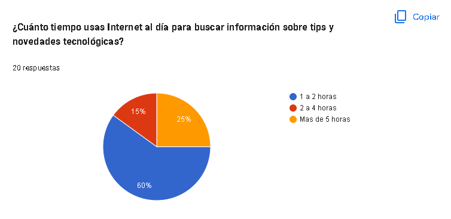
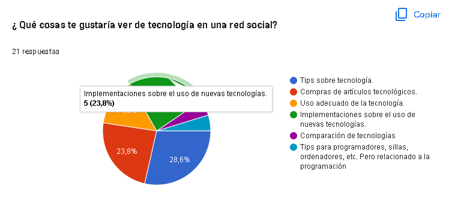
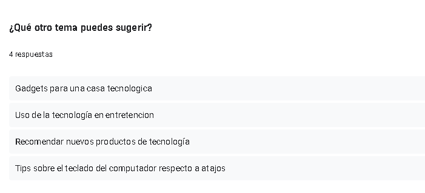
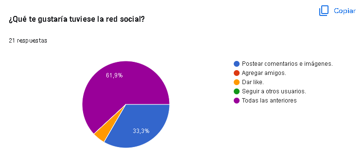
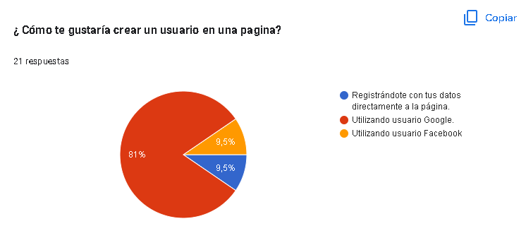
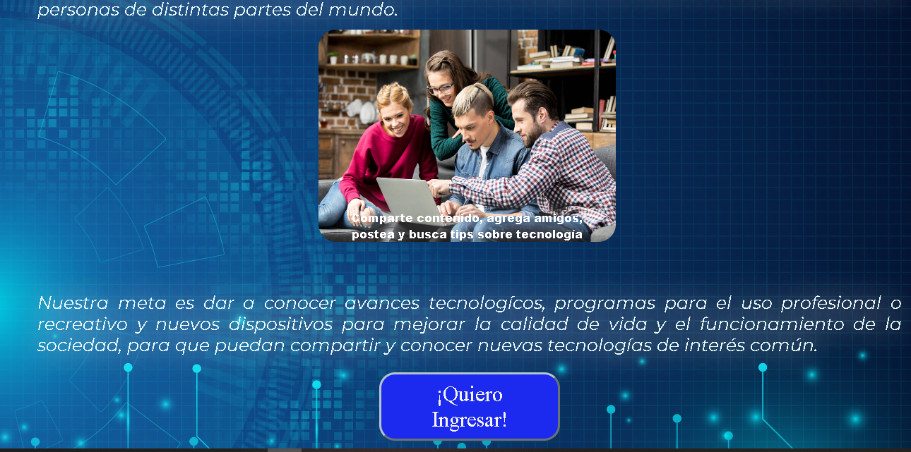
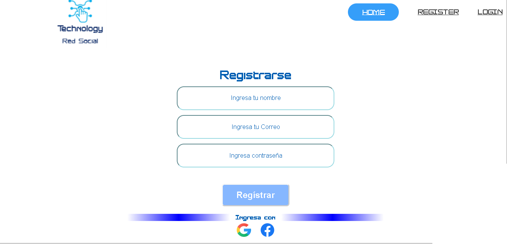
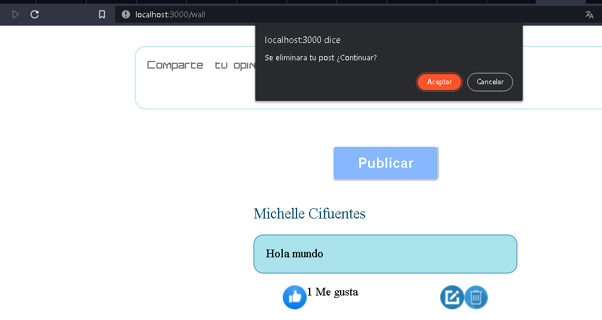

# TECHNOLOGY RED SOCIAL, DE BEATRIZ Y MICHELLE

Technology Red Social, está orientada para los amantes de la tecnología, a fin de dar a conocer avances tecnológicos, información de programas para el uso profesional o recreativo, así como también información de los nuevos dispositivos que  mejoran la calidad de vida y el funcionamiento de la sociedad.

# Aquí puedes ver nuestro proyecto:

# HISTORIA DE USUARIOS:

Las historias de usuario se generan a partir de potenciales usuarios. Es por eso que desarrollamos una encuesta en los Formularios de Google, destacándose para nuestros usuarios objetivo los siguientes ítems: 

Interés en  temas tecnólogicos: 

Tiempo destinado para buscar información en internet:

Temas de interés: 

Información de interés a compartir en una Red Social:

Temas recomendados por los usuarios objetivos: 

Preferencia en cuánto al registro de usuario: 

# Prototipo: 
Luego de tener los resultados de la encuesta procedimos a crear el prototipo de alta fidelidad en Figma:
# Aquí puedes ver nuestro proyecto:

Iniciamos prototipo para pantallas de computador:

Y prototipo para Smartphone:

Nuestra primera historia de usuario fue crear la página de bienvenida con un carrusel de imágenes que explicara un poco acerca de la red social:

Al pinchar el boton de ingreso redirige al usuario a registrarse a la página de registro, en donde puede registrarse con su correo o bien iniciar sesión con Google o Facebook:

También tenemos una página de login donde el usuario, previamente registrado, puede iniciar sesión en su cuenta:

Al iniciar sesión el usuario es redirigido a la página del muro:

En donde puede hacer comentarios y darle like a ellos:

Eliminar comentarios:

Y editar comentarios para volver a sobre escribirlos:

Los usuarios, post, likes y ediciones quedan guardados en la nube de Cloud Firestore:

# Test de usabilidad
Nuestra aplicación fue utilizada por 3 usuarios inicialmente, dándonos el feedback de que les pareció fácil de entender su uso y aplicación, logrando registrarse, logearse y realizar comentarios en el muro de la aplicación sin ninguna dificultad.
